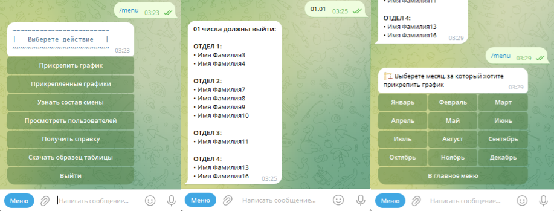

# Telegram bot для анализа рабочих графиков.
`Python 3.8` `Aiogram 3x` `SqlAlchemy(sqlite)` `Redis(FSM)` `gspread` `openpyxl`

# Описание:
Бот анализирует Exel таблицу с рабочим графиком подразделений компании и выводит фамилии работников за нужную дату. 
Предлагает скачать для заполнения шаблон таблицы. Далее можно сохранить таблицу, прикрепив ее к нужному месяцу через меню. Так же бот может считывать 
данные с онлайн таблиц Google Sheets. В главном меню есть справка и интуитивно понятный ui.
Суть в том, что подгрузив таблицу, можно узнавать полный состав смены, отправив дату.число.

### Основные характеристики
* Возможность загружать файлы с графиками или ссылки на онлайн таблицы google sheets.
* Предлагает скачать шаблон для графика.
* Имеет краткую справку.
* Удобное кнопочное меню.
* Возможность работы с FSM системой через Redis/MemoryStorage

### Установка
* Создать виртуальное окружение
* Установить зависимости из `requirements.txt`
* Настроить файл окружения env_dist и переименовать в .env
* Если для FSM системы состояний требуется постоянное хранилище - установить `Redis`